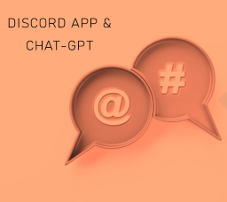

# discordGPT_Bot

I have developed a project where I created an application that enables real-time chat using the Chat-GPT language model in my Discord server! 🚀
This bot was built using the Python programming language and the Discord and OpenAI libraries. Configuring channel settings and bot reactions in the background made it easier to customize bot responses and control the flow of the conversation.
To accomplish this project, I integrated the Chat-GPT language model with my bot using the advanced chat features provided by Discord. As a result, I created an AI assistant that can automatically respond to questions asked in the Discord channel.
For example, when a user mentions the bot, it quickly analyzes the user's question using the Chat-GPT language model and generates the most suitable response. This allows for interactive real-time conversations using natural language processing capabilities.
To implement this project, I utilized the Discord server, Python programming language, and OpenAI's powerful GPT-3.5 language model. GPT-3.5 is an AI language model that can produce intelligent and consistent answers based on extensive knowledge.
This bot coding is an exciting example of using the Chat-GPT language model in real-time chat applications. 💬😊

